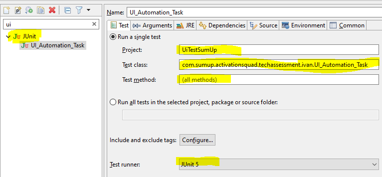

# Task 1 - UI automation
## Building the project
This project requires:
* [Eclipse](https://www.eclipse.org/downloads/)
* [Java-SE 17](https://www.oracle.com/java/technologies/downloads/)

To build the project: 
1. Open Eclipse > File > Import... > Existing Maven Project. 
2. In "Root directory", enter the path to this directory.
3. Press Finish.
4. In Eclipse > Project, activate the option "Build automatically".

## Executing the test (only Windows/Linux)
1. Make sure that a Chrome browser version 97 or greater is installed on your machine.
2. In Eclipse > Run > Run configurations... set the following:

3. Run the configuration - the test duration is circa 15 seconds.

