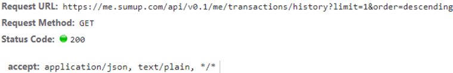

# Task 2 - Analysis of API calls

## Document details about the calls that aim to retrieve data about:

### Merchant account
    There is a call to the route https://me.sumup.com/api/v0.1/me, the HTTP verb is GET. 
    The array parameter “include” has the values “permissions” and “requirements”. 
    The call accepts data types json, text or anything.
    The call has a bearer authorization header with a JSON Web token.

    
    The response has a status code 200 (successful) and returns a json-formatted data:

    The json response contains merchant account details:

    There is a failing GET call to /me/card/account with a 404 status code (resource not found):

    The response is json-formatted and contains the error message:

### Sales history
    There is a call to the route https://me.sumup.com/api/v0.1/me/transactions/history
    The HTTP verb is GET. 
    The parameter order with value descending probably controls the sorting of results.
    The parameter limit with value 1 probably fetches a single transaction for performance reasons.
    The call accepts data types json, text or anything.
    The call has a bearer authorization header with the same JSON Web token.

    The response has a status code 200 (successful) and returns a json-formatted data.
    The response is an empty items list, because I have not made any sales:

    About a second later, there is a second attempt to fetch more sales history items, with the limit
    parameter value set to 30:
