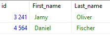
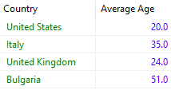

# Task 3 - SQL statements
## All‌‌ customers‌‌ from‌‌ United‌‌ States
```sql
/* Get the ID and names of customer filtered by country */
SELECT "id", "First_name", "Last_name" FROM customers WHERE "Country" = 'United States';
```

## All‌‌ customers‌‌ whose‌‌ details‌‌ were‌‌ not‌‌ updated‌‌ from‌‌ their‌ creation‌‌ on
```sql
SELECT customers."First_name", customers."Last_name"
FROM customers
JOIN customer_details 
ON customer_details."Updated_at" = customers."Created_at";

/* The same can be achieved with an IN keyword */
SELECT "First_name", "Last_name" FROM customers WHERE "id" IN (
	SELECT "Customer_id" 
	FROM customer_details 
	WHERE "Updated_at" = "Created_at"
);
```

## The average customer age per country
```sql
/* I use the truncate function to leave 1 significant decimal place */
SELECT customers."Country", TRUNC(AVG(customer_details."Age"), 1) AS "Average Age"
FROM customers
JOIN customer_details 
ON customer_details."Customer_id" = customers."id"
GROUP BY customers."Country";
```

Testing the above queries against the [data](create_tables.sql) in a Postgres 13 database produces:



